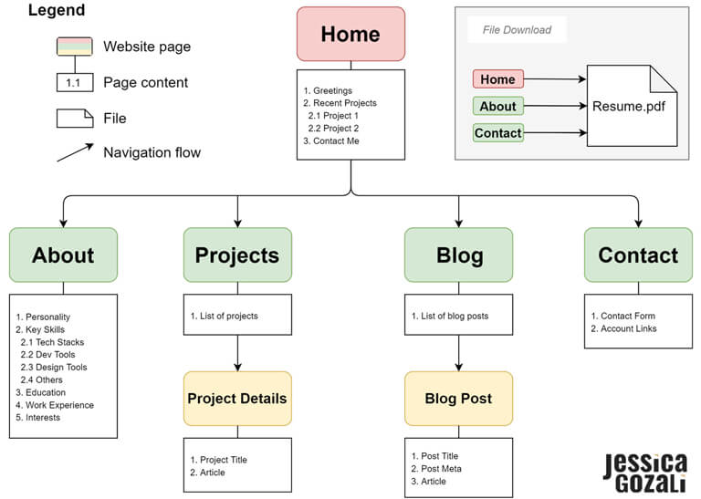
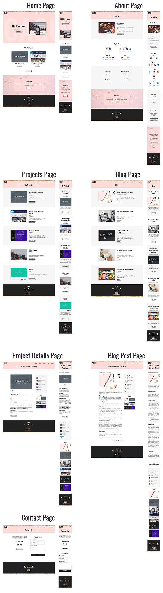

# Jessica Gozali Portfolio

> Live website link: [https://jessicagozali.netlify.app/](https://jessicagozali.netlify.app/)
>
>GitHub repository link: [https://github.com/petitejess/jg-portfolio](https://github.com/petitejess/jg-portfolio)

&nbsp;    

## Purpose
---

This Portfolio Website project demonstrates the level of understanding of *HTML* and *CSS* in their real-world application by creating a static website. It allows exposure to many aspects of website production process, including planning, design, implementation, security, ethics, testing, deployment, CI/CD.

The end-product, which is a *professional portfolio*, would be used as a showcase to display personality, skills, and interests to prospective employers.

&nbsp;    

## Functionality/Features
---

The website includes access to downloadable PDF Resume, blog with multiple posts in individual page, project showcase with individual project detail page, links to professional accounts and a contact form.

This portfolio website was made following **W3C standard** and **WCAG**, validated and tested using W3C online validation tools, colour contrast assessor tool listed in WCAG and Google lighthouse.

&nbsp;    

### Semantically structured HTML
This website uses proper and valid HTML semantics, such as proper use of heading tags in logical order, separation of different types of contents under correct HTML tags (i.e., navigation menu inside `<nav>`, header content inside `<header>` tag, main content inside `<main>` tag, etc.).

&nbsp;    

### HTML Code Validation
The core HTML code in each page of this website has been validated through [W3C HTML Validation Service](https://validator.w3.org/) and is error or warning free.

&nbsp;    

### CSS Code Validation
The core CSS code included in this website has been validated through [W3C CSS Validation Service](https://jigsaw.w3.org/css-validator/) and is error or warning free.

&nbsp;    

### WCAG for Accessibility Support
The colour contrast in this website passes the requirements per WCAG 2.1 guidelines, tested on [a11y Color Contrast Accessibility Validator](https://color.a11y.com/).

The website was designed with focus on accessibility support. For example, using clear outline on focused targetable element, logical tab order, Skip to content link, always visible labels that are associated properly with the corresponding input fields, semantically structured HTML, high contrast colours, etc.

&nbsp;    

### Responsive Mobile-First
The layout of this website was designed with **Mobile-First** approach, using *media query* breakpoints from small screen going to large screen to ensure all information is visible across all screen sizes.

The website layout also utilises CSS *flexbox* and *grid*, in conjunction with *relative measurement units* for font and container sizes.

&nbsp;    

### SRI Implementation
Subresource Integrity was implemented in this website for CSS file of Font Awesome (*all.min.css*) sourced from a CDN using **sha-512**. The main CSS stylesheet for this website (*main.css*) also implements SRI using **sha-512**, generated through openssl command.

&nbsp;    

## Sitemap
---

This website consists of 5 (five) top level pages, 5 (five) subpages under Projects page, 5 (five) subpages under Blog page, and 1 (one) downloadable PDF file.

The *sitemap.xml* file can be found in root folder of this website.

&nbsp;    

&nbsp;    

## Screenshots
---

&nbsp;    

&nbsp;

## Target Audience
---
The contents on the website include materials, brands, terms specific to website or software development industry. Therefore, the website is suitable for the following target audience:  
- Hiring personnel of a company
- Business owner of a technology company
- Digital agency

&nbsp;    

## Tech Stack
---

Technology and tools used in the process of development and deployment of this portfolio project will be listed below.

&nbsp;    

### Technology and Development Tools
- HTML5
- CSS3
- SASS
- VS Code
- Git
- GitHub

&nbsp;    

### Planning and Design Tools
- Trello
- diagrams.net
- XML Sitemaps
- Balsamiq
- Adobe Photoshop
- Adobe Illustrator

&nbsp;    

### Deployment Platform
- Netlify

&nbsp;    

## Resources
Images and materials used within this website are either from personal source or stock images from Pexels, under Pexels License: free to use, attribution is not compulsory, modification is permitted.